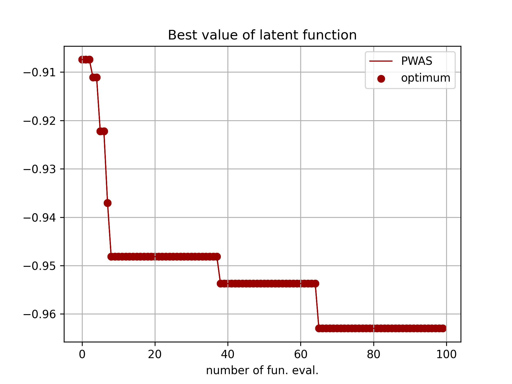

# Global and Preference-based Optimization with Mixed Variables using Piecewise Affine Surrogates (PWAS/PWASp)


# Contents

* [Package description](#description)

* [Installation](#install)

* [Basic usage](#basic-usage)

* [Contributors](#contributors)

* [Citing PWAS](#bibliography)

* [License](#license)

<a name="description"></a>
## Package description

We propose a novel surrogate-based global optimization algorithm, called PWAS, based on constructing a **p**iece**w**ise **a**ffine **s**urrogate of the objective function over feasible samples. We introduce two types of exploration functions to efficiently search the feasible domain via mixed integer linear programming (MILP) solvers. We also provide a preference-based version of the algorithm, called PWASp, which can be used when only pairwise comparisons between samples can be acquired while the objective function
remains unquantified. For more details on the method, please read our paper [Global and Preference-based Optimization with Mixed Variables using Piecewise Affine Surrogates](http://arxiv.org/abs/2302.04686). 

<a name="cite-ZB23"><a>
> [1] M. Zhu and A. Bemporad, "[Global and preference-based optimization with mixed variables using piecewise affine surrogates](http://arxiv.org/abs/2302.04686)," *Submitted for publication*, 2023. [[bib entry](#ref1)]

<a name="install"></a>
## Installation

~~~code
pip install pwasopt
~~~


### Dependencies:
* python 3
* numpy
* scipy
* pulp
* sklearn
* [pyparc](https://pypi.org/project/pyparc/)
* [pyDOE](https://pythonhosted.org/pyDOE/)
* [pycddlib](https://pypi.org/project/pycddlib/)


<a name="basic-usage"></a>
## Basic usage

### Examples
Examples of benchmark testing using PWAS/PWASp can be found in the `examples` folder:
* `mixed_variable_benchmarks.py`: benchmark testing on constrained/unconstrained mixed-variable problems
  * Test results are reported in the [paper](http://arxiv.org/abs/2302.04686)
* `other_benchmarks.py`: various NLP, MIP, INLP, MIP Benchmarks tested with PWAS/PWASp
  * Test results are reported in [test_results_on_other_benchmarks.pdf](https://github.com/mjzhu-p/PWAS/blob/main/examples/test_results_on_other_benchmarks.pdf) under the `examples` folder 


Here, we show a detailed example using PWAS/PWASp to optimize the parameters of the [`xgboost` algorithm](https://xgboost.readthedocs.io/en/stable/) for [`MNIST` classification](https://scikit-learn.org/stable/modules/generated/sklearn.datasets.load_digits.html) task. 


### Problem discription

**_Objective_**:
Maximize the classification accuracy on test data.

**_Optimization variables_**:
$n_c = 4$ (number of continuous variables), $n_{\rm int} = 1$ (number of integer variables, **ordinal**), 
and $n_d = 3$ (number of categorical variables, non-**ordinal**) with $n_{i} = 2$, for $i = 1, 2, 3$. 
Each categorical variable ($n_{di}$) can be either 0 or 1. 
The bounds are $\ell_x = [10^{-6},10^{-6}\ 0.001\ 10^{-6}]\tr$, $u_x = [1 10 1 5]\tr$; $\ell_y = 1$, $u_y = 10$.

**_Notes_**:
The 0.7/0.3 stratified train/test split ratio is applied. 
The `xgboost` package is used on `MNIST` classification. 
The optimization variables in this problem are the parameters of the `xgboost` algorithm.
Specifically, the continuous variables $x_1$, $x_2$, $x_3$, and $x_4$ refer to the following parameters in `xgboost`, 
respectively: `learning_rate`, `min_split_loss`, `subsample` , and `reg_lambda`. 
The integer variable $y$ stands for the `max_depth`. As for the categorical variables, $n_{d1}$ indicates the booster type in 
`xgboost` where $n_{d1} = {0, 1}$ corresponding to {`gbtree`, `dart`}. $n_{d2}$ represents the `grow_policy`, 
where $n_{d2} = {0, 1}$ corresponding to {`depthwise`, `lossguide`}. 
$n_{d3}$ refers to the `objective`, where $n_{d3} = {0, 1}$ corresponding to {`multi:softmax`, `multi:softprob`}.


### Problem specification in Python
~~~python
import xgboost
from sklearn.datasets import load_digits
from sklearn.model_selection import train_test_split
from sklearn import metrics
import numpy as np

# info of optimization variables 
nc = 4  # number of continous variables
nint = 1 # number of integer variables, ordinal
nd = 3  # number of categorical variables, non-ordinal
X_d = [2, 2, 2]  # possible number of classes for each categorical variables

lb_cont_int = np.array([1e-6, 1e-6, 0.001, 1e-6, 1])  # lower bounds for continuous and integer variables
ub_cont_int = np.array([1, 10, 0.99999, 5, 10])  # upper bounds for continuous and integer variables
lb_binary = np.zeros((nd))  # lower bounds for one-hot encoded categorical variables, note the dimension is same as nd, it will be updated within the code
ub_binary = np.array([1, 1, 1]) # upper bounds for one-hot encoded categorical variables
lb = np.hstack((lb_cont_int, lb_binary)) # combined lower and upper bounds for the optimization variables
ub = np.hstack((ub_cont_int, ub_binary))

# load dataset
# example code: https://github.com/imrekovacs/XGBoost/blob/master/XGBoost%20MNIST%20digits%20classification.ipynb
mnist = load_digits()  
X, y = mnist.data, mnist.target
X_train, X_test, y_train, y_test = train_test_split(X, y, train_size=0.7, test_size=0.3, stratify=y,
                                                    random_state=1)  # random_state used for reproducibility
dtrain = xgboost.DMatrix(X_train, label=y_train)
dtest = xgboost.DMatrix(X_test, label=y_test)

# define the objective function, x collects all the optimization variables, ordered as [continuous, integer, categorical]
def fun(x):  
    xc = x[:nc]  # continuous variables
    xint = x[nc:nc + nint]  # integer variables
    xd = x[nc + nint:]  # categorical variables

    if xd[0] == 0:
        mnist_booster = 'gbtree'
    else:
        mnist_booster = 'dart'

    if xd[1] == 0:
        mnist_grow_policy = 'depthwise'
    else:
        mnist_grow_policy = 'lossguide'

    if xd[2] == 0:
        mnist_obj = 'multi:softmax'
    else:
        mnist_obj = 'multi:softprob'
    param = {
        'booster': mnist_booster,
        'grow_policy': mnist_grow_policy,
        'objective': mnist_obj,
        'learning_rate': xc[0],
        'min_split_loss': xc[1],
        'subsample': xc[2],
        'reg_lambda': xc[3],
        'max_depth': round(xint[0]),
        'num_class': 10  # the number of classes that exist in this datset
    }

    bstmodel = xgboost.train(param, dtrain)

    y_pred = bstmodel.predict(
        dtest)  # somehow predict gives probability of each class instead of which class it belongs in...

    try:
        acc = metrics.accuracy_score(y_test, y_pred)

    except:
        y_pred = np.argmax(y_pred, axis=1)
        acc = metrics.accuracy_score(y_test, y_pred)

    return -acc  # maximize the accuracy, minimze the -acc

# Specify the number of maximum number of evaluations (including initial sammples) and initial samples
maxevals = 100
n_initil = 20

# default setting for the benchmarks
isLin_eqConstrained = False  # specify whether linear equality constraints are present
isLin_ineqConstrained = False  # specify whether linear inequality constraints are present
Aeq = np.array([])  # linear equality constraints
beq = np.array([])
Aineq = np.array([])  # linear inequality constraints
bineq = np.array([])

~~~

### Solve use PWAS

One can solve the optimization problem either by explicitly passing the function handle `fun` to PWAS, or by passing 
the evaluation of `fun` step-by step.

#### Solve by explicitly passing the function handle
~~~python
from pwasopt.main_pwas import PWAS  

key = 0
np.random.seed(key)  # rng default for reproducibility
print("Solve the problem by feeding the simulator/synthetic decision-maker directly into the PWAS solver")

delta_E = 0.05  # trade-off hyperparameter in acquisition function between exploitation of surrogate and exploration of exploration function
acq_stage = 'multi-stage'  # can specify whether to solve the acquisition step in one or multiple stages (as noted in Section 3.4 in [1]. Default: `multi-stage`
feasible_sampling = True  # can specify whether infeasible samples are allowed. Default True
K_init = 20  # number of initial PWA partitions

# initialize the PWAS solver
optimizer1 = PWAS(fun, lb, ub, delta_E, nc, nint, nd, X_d, nsamp, maxevals,  # pass fun to PWAS
                 feasible_sampling= feasible_sampling,
                 isLin_eqConstrained=isLin_eqConstrained, Aeq=Aeq, beq=beq,
                 isLin_ineqConstrained=isLin_ineqConstrained, Aineq=Aineq, bineq=bineq,
                 K=K_init, categorical=False,
                 acq_stage=acq_stage)

xopt1, fopt1 = optimizer1.solve()
X1 = np.array(optimizer1.X)
fbest_seq1 = optimizer1.fbest_seq
~~~

#### Solve by passing the function evaluation step-by step
~~~python
print("Solve the problem incrementally (i.e., provide the function evaluation at each iteration)")
optimizer2 = PWAS(fun, lb, ub, delta_E, nc, nint, nd, X_d, nsamp, maxevals,  # here, fun is a placeholder passed to PWAS, not used
                 feasible_sampling= feasible_sampling,
                 isLin_eqConstrained=isLin_eqConstrained, Aeq=Aeq, beq=beq,
                 isLin_ineqConstrained=isLin_ineqConstrained, Aineq=Aineq, bineq=bineq,
                 K=K_init, categorical=False,
                 acq_stage=acq_stage)

x2 = optimizer2.initialize()
for k in range(maxevals):
    f = fun(x2)  # evaluate fun
    x2 = optimizer2.update(f) # feed function evaluation step by step to PWAS
X2 = np.array(optimizer2.X[:-1])  # it is because in prob.update, it will calculate the next point to query (the last x2 is calculated at max_evals +1)
xopt2 = optimizer2.xbest
fopt2 = optimizer2.fbest
X2 = np.array(optimizer2.X)
fbest_seq2 = optimizer2.fbest_seq

~~~
Below we show the best values `fbest_seq1` found by PWAS


 


<a name="contributors"><a>
## Contributors

This package was coded by Mengjia Zhu with supervision from Prof. Alberto Bemporad.


This software is distributed without any warranty. Please cite the above papers if you use this software.

<a name="bibliography"><a>
## Citing PWAS/PWASp

<a name="ref1"></a> 

Please cite ur paper if you would like to use the code.


<a name="ref1"></a>

```
@article{ZB23,
    author={M. Zhu, A. Bemporad},
    title={Global and Preference-based Optimization with Mixed Variables using Piecewise Affine Surrogates},
    journal={arXiv preprint arXiv:2302.04686},
    year=2023
}
```

<a name="license"><a>
## License

Apache 2.0

(C) 2021-2023 M. Zhu, A. Bemporad

 
